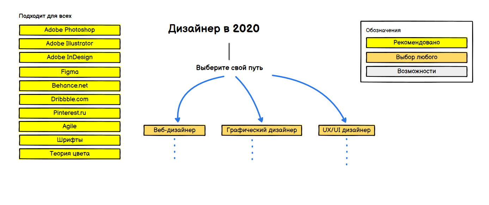

> План действий для того, чтобы стать дизайнером в 2020

Ниже вы найдете набор диаграмм, которые пошагово покажут, какие технологии и инструменты изучать, чтобы стать:
- Веб-дизайнером
- Графическим дизайнером
- UX/UI Дизайнером

***

<h3 align="center"><strong>Для кого?</strong></h3>

> Это будет полезно тем, кто хочет освоить необходимые навыки дизайнера, чтобы выбрать специализацию и начать карьеру в дизайне. Подходит новичкам, чтобы войти в профессию. Дизайнерам с базовым уровнем, чтобы стать более востребованным специалистом и заполнить недостающие пробелы. Дизайнерам на фрилансе, чтобы прокачать навыки и структурировать работу с заказчиком.

***

Если вы считаете, что можете что-то улучшить, то, пожалуйста, предложите.

## Введение

